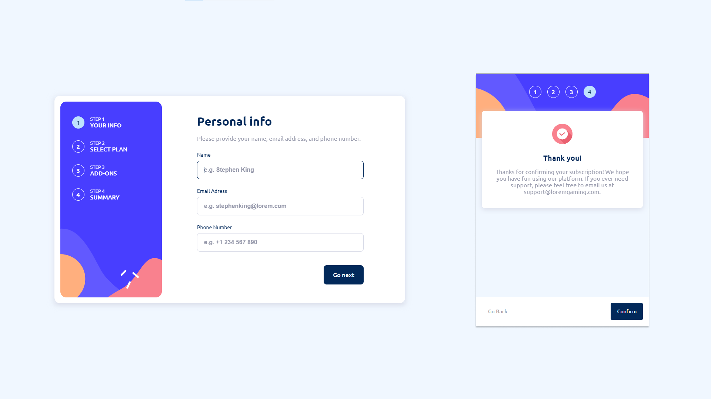

# Frontend Mentor - Multi-step form solution

This is a solution to the [Multi-step form challenge on Frontend Mentor](https://www.frontendmentor.io/challenges/multistep-form-YVAnSdqQBJ). Frontend Mentor challenges help you improve your coding skills by building realistic projects.

## Table of contents

- [Overview](#overview)
  - [The challenge](#the-challenge)
  - [Screenshot](#screenshot)
  - [Links](#links)
- [My process](#my-process)
  - [Built with](#built-with)
  - [What I learned](#what-i-learned)
  - [Continued development](#continued-development)
- [Author](#author)

## Overview

### The challenge

Users should be able to:

- Complete each step of the sequence
- Go back to a previous step to update their selections
- See a summary of their selections on the final step and confirm their order
- View the optimal layout for the interface depending on their device's screen size
- See hover and focus states for all interactive elements on the page
- Receive form validation messages if:
  - A field has been missed
  - The email address is not formatted correctly
  - A step is submitted, but no selection has been made

### Screenshot



### Links

- Solution URL: [https://github.com/grzeg95/multi-step-form-main/](https://github.com/grzeg95/multi-step-form-main/)
- Live Site URL: [https://multi-step-form-main.web.app/](https://multi-step-form-main.web.app/)

## My process

### Built with

- Firebase hosting:github
- [Angular 17](https://angular.dev/)
- SASS Theme
- Flexbox
- CSS BEM
- Mobile-first workflow

### What I learned

- use of own Angular library

```json
"@grzeg95/angular-lib-theme-selector": "^17.0.0"
```

- ngTemplateOutlet

```angular17html
@if (deviceService.screensSize() === 'desktop') {
  <ng-container *ngTemplateOutlet="stepper.currentStepActionsRef()"></ng-container>
}
```

- ControlValueAccessor

```ts
export class AddOnComponent implements ControlValueAccessor
```

- Stepper implementation

```angular17html
<app-stepper #stepper class="stepper" aria-label="Register form">
```

- Focus first invalid input when it is needed

```angular17html
<app-step [stepControl]="personalInfoFormGroup" class="app-register-form__stepper__steps__step" aria-label="Step 1 of 4 Personal info">
  <form appAbstractControlActions [formGroup]="personalInfoFormGroup" aria-label="Personal info form">
```

```ts
imports: [
  FormControlDirective
]

/////////////////////////////////

@ContentChild(AbstractControlActionsDirective, {descendants: true}) abstractControlActions!: AbstractControlActionsDirective;

updateValueAndValidity(): void {

  if (this.stepControl) {
    this.stepControl.updateValueAndValidity();
    this.stepControl.markAllAsTouched();
    
    if (this.stepControl instanceof FormGroup) {
      for (const [i, key] of Object.keys((this.stepControl as FormGroup).controls).entries()) {
        if ((this.stepControl as FormGroup).controls[key].invalid) {
          this.abstractControlActions.focus(i);
          break;
        }
      }
    }
  }
}
```

```ts
imports: [
  FormControlDirective
]
```

### Continued development

- Unit tests

## Author

- Frontend Mentor - [@grzeg95](https://www.frontendmentor.io/profile/grzeg95)
