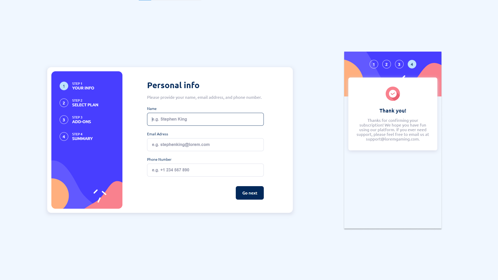

# Frontend Mentor - Multi-step form solution

This is a solution to the [Multi-step form challenge on Frontend Mentor](https://www.frontendmentor.io/challenges/multistep-form-YVAnSdqQBJ). Frontend Mentor challenges help you improve your coding skills by building realistic projects.

## Table of contents

- [Overview](#overview)
  - [The challenge](#the-challenge)
  - [Screenshot](#screenshot)
  - [Links](#links)
- [My process](#my-process)
  - [Built with](#built-with)
  - [What I learned](#what-i-learned)
  - [Continued development](#continued-development)
- [Author](#author)

**Note: Delete this note and update the table of contents based on what sections you keep.**

## Overview

### The challenge

Users should be able to:

- Complete each step of the sequence
- Go back to a previous step to update their selections
- See a summary of their selections on the final step and confirm their order
- View the optimal layout for the interface depending on their device's screen size
- See hover and focus states for all interactive elements on the page
- Receive form validation messages if:
  - A field has been missed
  - The email address is not formatted correctly
  - A step is submitted, but no selection has been made

### Screenshot



### Links

- Solution URL: [https://github.com/grzeg95/multi-step-form-main/](https://github.com/grzeg95/multi-step-form-main/)
- Live Site URL: [https://multi-step-form-main.web.app/](https://multi-step-form-main.web.app/)

## My process

### Built with

- Semantic HTML5 markup
- SCSS custom properties
- Flexbox
- Mobile-first workflow
- [Angular 17](https://angular.dev/)
- [Angular CDK](https://material.angular.io/cdk/)

### What I learned

- ngTemplateOutlet

```angular17html
@if (deviceService.screensSize() === 'desktop') {
  <ng-container *ngTemplateOutlet="stepper.currentStepActionsRef()"></ng-container>
}
```

- ControlValueAccessor

```ts
export class AddOnComponent implements ControlValueAccessor
```

- Stepper implementation
- Using of aria-label

```angular17html
<app-stepper #stepper class="stepper" aria-label="Register form">
```

- Using of Angular CDK Overlay

```scss
@import './styles/cdk/overlay';

@include overlay();
```

- Creating mixins in scss

```scss
@mixin button() { ... }

@include button;
```

### Continued development

- Unit tests

## Author

- Frontend Mentor - [@grzeg95](https://www.frontendmentor.io/profile/grzeg95)
